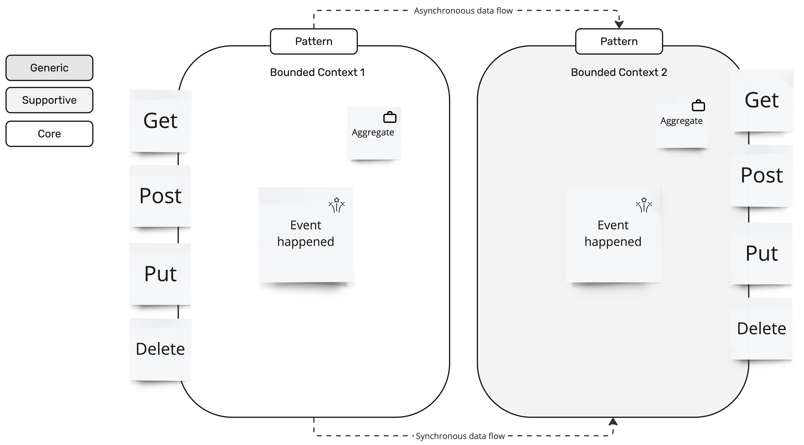

# Solution Approach

> **Note:**
> The solution approach shows how the scope can be implemented.
> It can be shown by a context map.

| Bounded Context | Pattern | Event                    | Aggregate | Asynchronous events | Synchronous APIs |
|-----------------|---------|--------------------------|-----------|----------------------|-----------------|
| Bounded Context 1, Core | Pattern | Event happened | Aggregate | Produces: Asynchronous data flow | Get, Post, Put, Delete |
| Bounded Context 2, Supportive | Pattern | Event happened | Aggregated | Consumes: Asynchronous data flow | Get, Post, Put, Delete |
| | | | | | |

