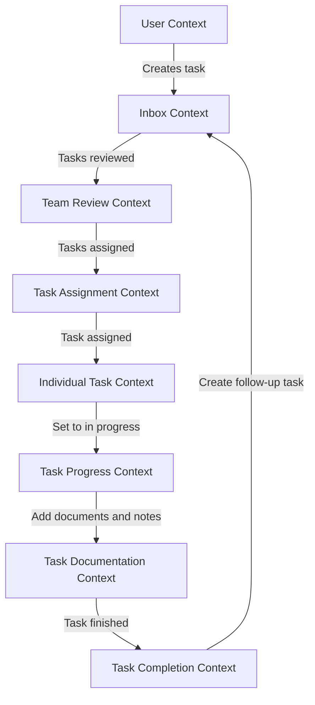

Certainly, I can help you create a context flow diagram based on the description you've provided. I'll use a Mermaid diagram to represent this flow, which will show the different contexts and their interactions in the task management process you've described.

This diagram illustrates the context flow of the task management process you described. Here's a breakdown of the contexts and their interactions:

1. User Context: Where the user initiates the process by creating a task.
2. Inbox Context: Where newly created tasks are stored.
3. Team Review Context: Where the team reviews tasks from the inbox.
4. Task Assignment Context: Where tasks are assigned to team members.
5. Individual Task Context: Represents the assigned task to a specific team member.
6. Task Progress Context: Where the assignee sets the task to "in progress".
7. Task Documentation Context: Where documents and notes are added to the task.
8. Task Completion Context: Where the task is finished.

The flow shows how a task moves through these contexts, starting from creation and ending with completion, with the possibility of creating a follow-up task that goes back to the Inbox Context.

This diagram helps visualize the different bounded contexts in your domain and how they interact, which is a key aspect of Strategic Design in Domain-Driven Design. It can be useful for identifying potential aggregate boundaries and understanding the flow of information and actions in your system.

Would you like me to elaborate on any part of this diagram or discuss how it relates to DDD principles?