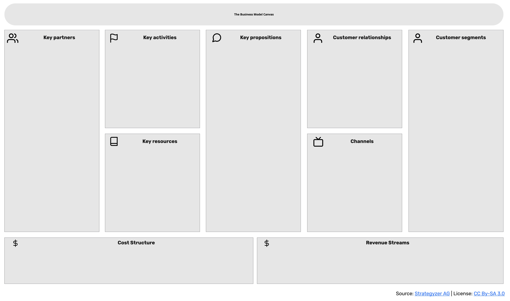

# Introduction and Scope

> **Note:**
> The introduction and scope section contains information about the product development.
> The target can be introduced by a couple of sentences.
> The scope of the product is shown by a business model canvas.
> The business model canvas needs to be given as picture and as describing table.
> The section contains two subsections: Quality requirements and Stakeholders.

| Part | Topic | Description |
|------|-------|-------------|
| Key partners | | |
| Key activities | | |
| Key resources | | |
| Key propositions | | |
| Customer relationships | | |
| Channels | | |
| Customer segments | | |
| Cost relations | | |
| Revenue streams | | |

## Quality requirements

> **Note:**
> Quality requirements are described as a table concentrating on the most relevant, cross-bounded-contexts requirements.
> It is advisable not to discuss more than seven targets here, otherwise it is challenging to balance out contradicting requirements in the solution design.

The quality requirements can be documented in a table.

| Priority | Target | Note |
|----------|--------|------|
| 1 | | |
| 2 | | |

## Stakeholders

> **Note:
> **
> Stakeholders can be listed in a table.
> As stakeholders, the key partners and customers of the business model canvas should appear.
> Additionally, sponsors of the product or project can be listed.
> Stakeholders listed with their individual target in relation to the product or project and their expectation to it.

| Role | Target | Expectation |
|------|--------|-------------|
| | | |

