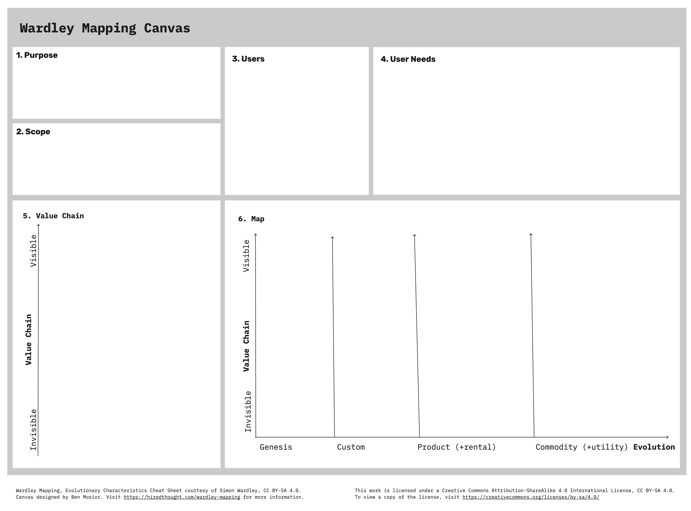

# Constraints

> **Note:**
> Constraints limit the solution area of the product and project. They need to be listed carefully.
> There are some technology selection constraints that need to be listed.
> Otherwise should be documented if certain capabilities should be implemented or bought.
> Therefore the constraints should contain the Wardley map additionally.

## Technical constraints

| Short | Note |
|-------|------|
| | |

## Wardley map

> **Note:**
> The Wardley map is described in the table by the containing capabilities in the respective evolution stages.
> The 'Relation to' column contains the relation to other capabilities down the visibility axis.

| Evolution stage | Capability | Relation to | Note |
|-----------------|------------|-------------|------|
| Genesis | | | |
| Custom | | | |
| Product | | | 
| Commodity | | |

