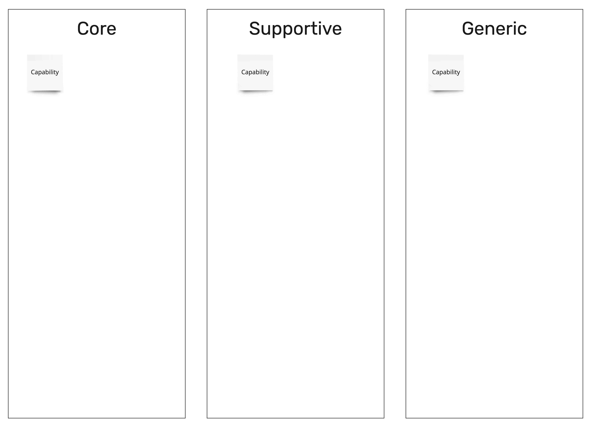
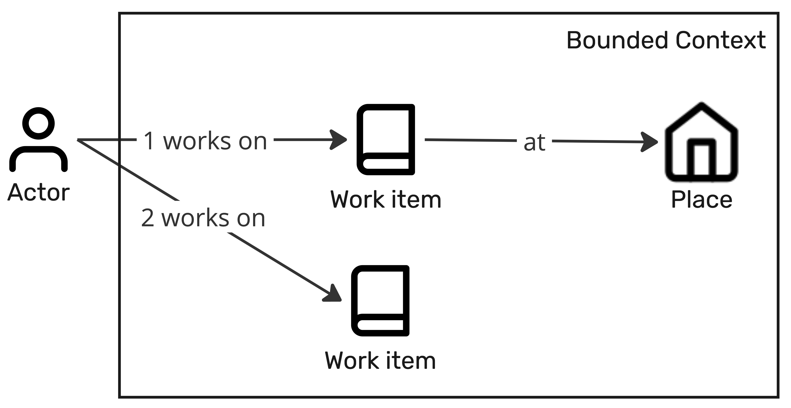

# Context

> **Note:**
> The context section starts with the capability map as part of the business target.
> The capabilities are listed as core, supportive, and generic capabilities.
> They are described in a table.
> They are listed after the discussion of the Wardley map.

| Subdomain | Capability | Note |
|-----------|------------|------|
| Core | | |
| Supportive | | |
| Generic | | |

### Business context

> **Note:**
> The business context is described as domain stories as a result of domain storytelling workshops.
> There could be multiple domain stories that need to be described.

| Bounded Context | No. | Sentence | Note |
|-----------------|-----|----------|------|
| Bounded Context | 1 | The actor works on the work item at the place. | |
| | 2 | The actor works on the work item- | |
| | | | |

### Technical context

> **Note:**
> The technical context is described as result of an event storming.

| Bounded Context | Role | Command | Read model | Event | Aggregate |
|-----------------|------|---------|------------|-------|-----------|
| Bounded Context 1 | Role | Let event happen | Read model | Event happened | Aggregate |
| Bounded Context 2 | Role | Let event happen | Read model | Event happened | Aggregate |
|                 |      |  |  |  |  |

